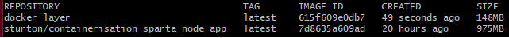

# Docker with the Nodejs App

## Dockerfile
- Create an image with the latest nodejs docker container
```dockerfile
FROM node:latest
```
- Create the working directory in the container
```dockerfile
WORKDIR /usr/src/app
```
- Copy the app folder in this working directory to the container usr/src/ directory
```dockerfile
COPY app/ .
```
- run the npm install command
```dockerfile
RUN npm install
```
- Allow app to run on port 3000
```dockerfile
EXPOSE 3000
```
- Start the app
```dockerfile
CMD ["node", app.js"]
```

## Build image
- to build the image we ran 
```bash
docker build -t sturton/containerisation_sparta_node_app .
```
- This reads the docker file, and creates a container

- To run the container on port 80 we dont need a reverse proxy and can use the following command
- 
```bash
docker run -d -p 80:3000 sturton/containerisation_sparta_node_app
```
- This should show on the local host port

- The image can now be used using the `sturton/containerisation_sparta_node_app`
 
## Docker layer / multi stage build
```dockerfile
# Creating micro-services for nodejs front end
FROM node as APP

LABEL MAINTAINER=STurton@spartaglobal.com

WORKDIR /usr/src/app
# path to working directory inside the container

#copy the required dependencies
copy ./app/ . 

FROM node:alpine
# building a multi stage layer

COPY --from=app /usr/src/app /usr/src/app

WORKDIR /usr/src/app

# run the npm install
RUN npm install

EXPOSE 3000

CMD ["node", "app.js"]
```

- this makes the same container 1/8th of the size

